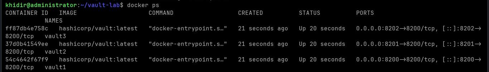
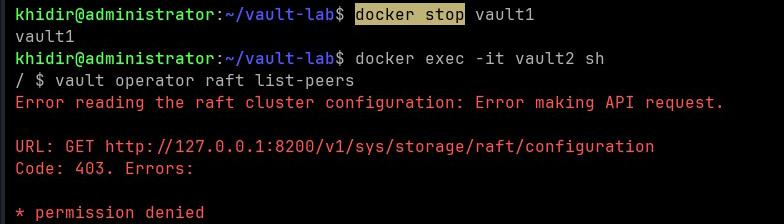
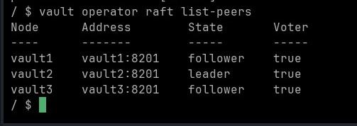

# HashiCorp Vault OSS — Raft HA 3-Node Lab (Docker)

> Lab ini mensimulasikan setup Vault HA production grade menggunakan integrated storage Raft, berjalan di atas Docker Compose

## Arsitektur

```
             Raft Cluster

        vault1 (leader)
             |
     ----------------
     |              |
 vault2          vault3
(follower)      (follower)
```

Semua node berkomunikasi lewat Docker internal network. Port yang diekspos ke host:

| Container | Host Port | Fungsi          |
|-----------|-----------|-----------------|
| vault1    | 8200      | API / UI        |
| vault2    | 8201      | API / UI        |
| vault3    | 8202      | API / UI        |

## Prasyarat

- Docker Engine + Compose Plugin
- Linux (Debian/Ubuntu/Kali)

```bash
sudo apt update && sudo apt install docker.io docker-compose-plugin -y
docker --version
```

## 1. Struktur Folder

```bash
mkdir vault-lab && cd vault-lab
mkdir -p vault1/{data,config} vault2/{data,config} vault3/{data,config}
```

Hasil:

```
vault-lab/
├── docker-compose.yml
├── vault1/
│   ├── config/config.hcl
│   └── data/
├── vault2/
│   ├── config/config.hcl
│   └── data/
└── vault3/
    ├── config/config.hcl
    └── data/
```

## 2. docker-compose.yml

```yaml
services:
  vault1:
    image: hashicorp/vault:latest
    container_name: vault1
    ports:
      - "8200:8200"
    volumes:
      - ./vault1/data:/vault/data        # Menyimpan data Vault agar tidak hilang
      - ./vault1/config:/vault/config    # Mengarahkan file konfigurasi dengan tepat
    environment:
      VAULT_ADDR: http://127.0.0.1:8200
    cap_add:
      - IPC_LOCK
    command: server

  vault2:
    image: hashicorp/vault:latest
    container_name: vault2
    ports:
      - "8201:8200"
    volumes:
      - ./vault2/data:/vault/data
      - ./vault2/config:/vault/config
    environment:
      VAULT_ADDR: http://127.0.0.1:8200
    cap_add:
      - IPC_LOCK
    command: server

  vault3:
    image: hashicorp/vault:latest
    container_name: vault3
    ports:
      - "8202:8200"
    volumes:
      - ./vault3/data:/vault/data
      - ./vault3/config:/vault/config
    environment:
      VAULT_ADDR: http://127.0.0.1:8200
    cap_add:
      - IPC_LOCK
    command: server
```

> **Catatan:** Penggunaan command `server` tanpa flag `-config` mengharuskan file konfigurasi tersedia pada path default `/vault/config/config.hcl`.

Jika menjalankan command `server -config=/vault/config/config.hcl`, Vault akan membaca konfigurasi dari direktori tersebut secara otomatis, kemudian memuat file `config.hcl` secara eksplisit. Hal ini menyebabkan konfigurasi diproses lebih dari satu kali, sehingga Vault mencoba melakukan inisialisasi listener pada port `8200` yang sama. Akibatnya, terjadi konflik karena port tersebut sudah digunakan oleh proses Vault itu sendiri.

## 3. Konfigurasi HCL

Buat file `config.hcl` di masing-masing folder config. Perbedaan antar node hanya pada `node_id`, `api_addr`, dan `cluster_addr`.

### vault1/config/config.hcl

```hcl
storage "raft" {
  path    = "/vault/data"
  node_id = "vault1"
}

listener "tcp" {
  address     = "0.0.0.0:8200"
  tls_disable = true
}

disable_mlock = true

api_addr     = "http://vault1:8200"
cluster_addr = "http://vault1:8201"

ui = true
```

### vault2/config/config.hcl

```hcl
storage "raft" {
  path    = "/vault/data"
  node_id = "vault2"
}

listener "tcp" {
  address     = "0.0.0.0:8200"
  tls_disable = true
}

disable_mlock = true

api_addr     = "http://vault2:8200"
cluster_addr = "http://vault2:8201"

ui = true
```

### vault3/config/config.hcl

```hcl
storage "raft" {
  path    = "/vault/data"
  node_id = "vault3"
}

listener "tcp" {
  address     = "0.0.0.0:8200"
  tls_disable = true
}

disable_mlock = true

api_addr     = "http://vault3:8200"
cluster_addr = "http://vault3:8201"

ui = true
```

> **Kenapa menggunakan `disable_mlock = true`?**
> `mlock()` adalah syscall Linux yang digunakan untuk mengunci area memori agar tidak dipindahkan (swap) ke disk. Mekanisme ini penting pada environment production karena membantu mencegah secret sensitif tersimpan di swap file.

> Pada environment lab atau container, proses Vault biasanya tidak memiliki privilege yang diperlukan untuk menjalankan `mlock()`. Akibatnya, Vault dapat gagal melakukan start karena tidak dapat mengunci memori sesuai konfigurasi. Dengan mengatur `disable_mlock = true`, Vault akan melewati kebutuhan tersebut sehingga dapat berjalan pada environment yang memiliki keterbatasan privilege.

> **Catatan:** Jangan mengaktifkan `disable_mlock = true` pada production bare-metal tanpa memahami risikonya, karena dapat mengurangi proteksi terhadap kemungkinan secret terekspos melalui mekanisme swap.

## 4. Start Cluster

```bash
docker compose up -d
docker ps
```



Output yang diharapkan:

```
CONTAINER ID   IMAGE                    COMMAND               STATUS
xxxxxxxxxxxx   hashicorp/vault:latest   "docker-entrypoint…"  Up   vault3
xxxxxxxxxxxx   hashicorp/vault:latest   "docker-entrypoint…"  Up   vault2
xxxxxxxxxxxx   hashicorp/vault:latest   "docker-entrypoint…"  Up   vault1
```

## 5. Init & Unseal vault1

```bash
docker exec -it vault1 sh
export VAULT_ADDR=http://127.0.0.1:8200
vault operator init
```

Output:

```
Unseal Key 1: <key1>
Unseal Key 2: <key2>
Unseal Key 3: <key3>
Unseal Key 4: <key4>
Unseal Key 5: <key5>

Initial Root Token: <root-token>
```

**Simpan semua key dan root token.** Tidak bisa di-recover.

> Lalu unseal dengan 3 dari 5 key:

```bash
vault operator unseal <key1>
vault operator unseal <key2>
vault operator unseal <key3>
```

```bash
vault status
```

```
Sealed     false
```

```bash
vault login <root-token>
exit
```

### Kenapa hanya butuh 3 dari 5 unseal key?

Vault menggunakan skema **Shamir's Secret Sharing** untuk membagi *master encryption key*. Kunci utama tersebut akan dipecah menjadi `N` bagian (*key shares*), dan Vault membutuhkan minimal `T` bagian (*threshold*) untuk dapat merekonstruksi kembali kunci tersebut.

Secara konsep, jika terdapat `N` key share yang diberikan kepada `N` pihak berbeda, tidak ada satu pihak pun yang dapat membuka Vault secara mandiri. Proses *unseal* hanya dapat dilakukan apabila jumlah key share yang dikumpulkan mencapai nilai `T`. Mekanisme ini menerapkan prinsip **zero-trust key distribution**, sehingga satu administrator saja tidak memiliki kemampuan untuk membuka Vault production secara sepihak.

Konfigurasi default Vault menggunakan:

* `key-shares = 5`
* `key-threshold = 3`

Artinya, dari 5 *unseal key* yang dibuat, minimal 3 key diperlukan untuk melakukan proses *unseal*.

Nilai tersebut dapat disesuaikan ketika proses inisialisasi:

```bash
vault operator init -key-shares=7 -key-threshold=4
```

Dengan konfigurasi tersebut, Vault akan menghasilkan 7 *key shares* dan membutuhkan minimal 4 key untuk melakukan *unseal*.

## 6. Join vault2 & vault3 ke Cluster

### vault2

```bash
docker exec -it vault2 sh
export VAULT_ADDR=http://127.0.0.1:8200
vault operator raft join http://vault1:8200
vault operator unseal <key1>
vault operator unseal <key2>
vault operator unseal <key3>
exit
```

### vault3

```bash
docker exec -it vault3 sh
export VAULT_ADDR=http://127.0.0.1:8200
vault operator raft join http://vault1:8200
vault operator unseal <key1>
vault operator unseal <key2>
vault operator unseal <key3>
exit
```

## 7. Verifikasi Cluster

```bash
docker exec -it vault1 sh
export VAULT_ADDR=http://127.0.0.1:8200
vault login <root-token>
vault operator raft list-peers
```

Output:

```
Node      Address        State       Voter
----      -------        -----       -----
vault1    vault1:8201    leader      true
vault2    vault2:8201    follower    true
vault3    vault3:8201    follower    true
```


## 8. Test Failover (Leader Election)

Stop vault1 (current leader):

```bash
docker stop vault1
```

Tunggu ~5–10 detik untuk Raft election selesai, lalu masuk vault2:

```bash
docker exec -it vault2 sh
export VAULT_ADDR=http://127.0.0.1:8200
vault login <root-token>
vault operator raft list-peers
```

> **Kenapa harus login dulu?**
> `vault operator raft list-peers` adalah privileged operation yang butuh autentikasi valid. Token Vault tidak persisted di sisi client shell — saat kamu masuk ke shell container baru via `docker exec`, tidak ada token aktif. Tanpa login, Vault langsung tolak dengan `403 permission denied`.

Contoh error bila langsung tanpa login:

```
Error reading the raft cluster configuration: Error making API request.
URL: GET http://127.0.0.1:8200/v1/sys/storage/raft/configuration
Code: 403. Errors:
* permission denied
```



Setelah login dengan root token:

```bash
vault login <root-token>
vault operator raft list-peers
```

Output setelah election:

```
Node      Address        State       Voter
----      -------        -----       -----
vault1    vault1:8201    follower    true
vault2    vault2:8201    leader      true
vault3    vault3:8201    follower    true
```



> **Catatan:** vault1 tetap muncul sebagai `follower` dengan `Voter: true` — bukan hilang dari cluster. Ini karena `docker stop` mengirim SIGTERM, container shutdown graceful, dan vault1 sempat deregister diri dari Raft sebelum benar-benar mati. Raft election tetap terjadi (vault2 jadi leader), tapi vault1 masih tercatat sebagai peer yang dikenal cluster.
>
> Behavior `Voter: false` hanya muncul bila node dihapus paksa dari cluster via `vault operator raft remove-peer` atau node crash tanpa sempat deregister dan sudah melewati batas timeout.

Raft menggunakan algoritma konsensus berbasis quorum — dari 3 node, minimal 2 harus setuju untuk eleksi leader baru. Dengan 1 node mati, masih ada 2 node yang membentuk quorum valid.

Start vault1 kembali:

```bash
docker start vault1
```

vault1 akan unseal dan rejoin sebagai follower. Perlu unseal ulang karena Vault selalu sealed setiap kali proses restart.

## 9. Snapshot Backup

```bash
docker exec -it vault1 sh
export VAULT_ADDR=http://127.0.0.1:8200
vault login <root-token>
vault operator raft snapshot save /tmp/backup.snap
ls -lh /tmp/backup.snap
```

Output:

```
-rw-------    1 vault    vault      14.3K Jun 15 12:44 /tmp/backup.snap
```

Copy ke host:

```bash
docker cp vault1:/tmp/backup.snap ./backup.snap
```

### Restore (bila diperlukan)

```bash
vault operator raft snapshot restore ./backup.snap
```

## Penutup

Lab ini bukan hanya bertujuan untuk menjalankan Vault menggunakan Docker, tetapi juga memahami bagaimana Vault dirancang untuk digunakan pada lingkungan production.

Konsep yang dipelajari mencakup distribusi trust menggunakan **Shamir's Secret Sharing**, menjaga konsistensi data antar node dengan **Raft consensus**, serta mekanisme pemulihan cluster ketika terjadi kegagalan node melalui **leader election** dan **automatic rejoin**.

Dengan simulasi ini, dapat terlihat bagaimana Vault menangani aspek keamanan dan availability tanpa bergantung pada satu komponen saja.
Thankyou;v

