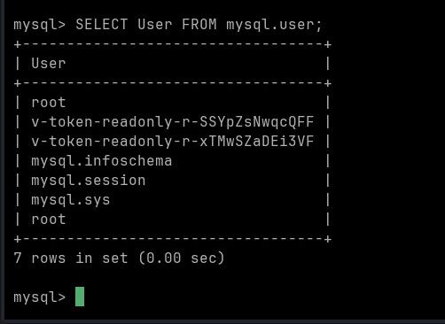

# Vault Database Secrets Engine: MySQL/MariaDB Dynamic Credentials

## Konsep Dasar

MySQL/MariaDB Database Plugin bekerja persis seperti MSSQL. Vault membuat user MySQL secara dinamis menggunakan `CREATE USER`, memberikan hak akses via `GRANT`, lalu otomatis `DROP` user saat TTL habis.

## Persiapan Lingkungan (Docker Compose)

Buat file `docker-compose.yml`:

```yaml
services:
  vault:
    image: hashicorp/vault:latest
    container_name: vault-dev
    ports:
      - "8200:8200"
    environment:
      - VAULT_DEV_ROOT_TOKEN_ID=root
      - VAULT_DEV_LISTEN_ADDRESS=0.0.0.0:8200
    cap_add:
      - IPC_LOCK

  mysql:
    image: mysql:9.0
    container_name: mysql-dev
    ports:
      - "3306:3306"
    environment:
      - MYSQL_ROOT_PASSWORD=khidir
```

Jalankan:

```bash
docker compose up -d
```

## Konfigurasi Vault

Masuk ke dalam kontainer Vault:

```bash
docker exec -it vault-dev sh
```

### 1. Login & Aktifkan Database Secrets Engine

```bash
export VAULT_TOKEN=root
export VAULT_ADDR=http://127.0.0.1:8200

vault secrets enable database
```

### 2. Konfigurasi Koneksi ke MySQL

```bash
vault write database/config/my-mysql-db \
    plugin_name=mysql-database-plugin \
    connection_url="{{username}}:{{password}}@tcp(mysql:3306)/" \
    allowed_roles="readonly-role" \
    username="root" \
    password="khidir"
```

> `tcp(mysql:3306)` menggunakan nama service Docker, bukan `localhost`, karena keduanya berada di jaringan Docker yang sama.

### 3. Buat Role untuk Akses Dinamis

```bash
vault write database/roles/readonly-role \
    db_name=my-mysql-db \
    creation_statements="CREATE USER '{{name}}'@'%' IDENTIFIED BY '{{password}}'; GRANT SELECT ON *.* TO '{{name}}'@'%';" \
    default_ttl="1h" \
    max_ttl="24h"
```

### 4. Generate Kredensial Dinamis

```bash
vault read database/creds/readonly-role
```

Output:

```
Key                Value
---                -----
lease_id           database/creds/readonly-role/1fltE3rpkxxxxxx
lease_duration     1h
lease_renewable    true
password           CLIOFoN1F-YheZb-xxxx
username           v-token-readonly-r-xxxxxx
```



Setiap pemanggilan `vault read database/creds/readonly-role` menghasilkan username & password **baru yang unik**. Kredensial ini langsung bisa dipakai untuk login ke MySQL dan akan otomatis dihapus Vault setelah 1 jam.

## Verifikasi di MySQL

Login menggunakan kredensial yang di-generate Vault:

```bash
docker exec -it mysql-dev mysql -u v-token-readonly-r-xTMwSZaDEixxx -p
```

Cek daftar user yang aktif di MySQL:

```sql
SELECT User FROM mysql.user;
```


## Flowchart


-nano banana
